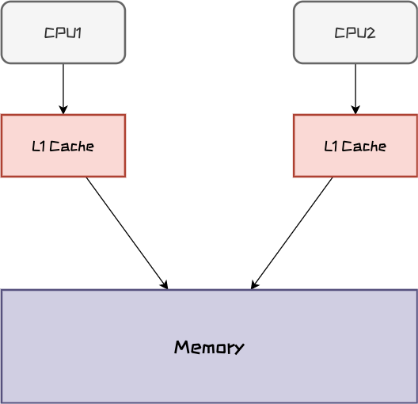
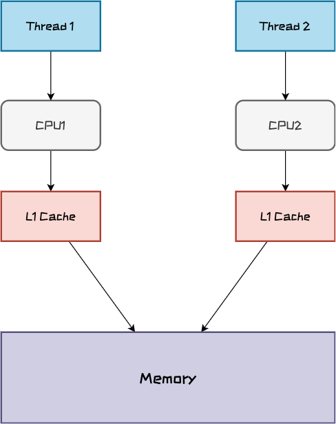

## 主题

- 并发问题的三个来源：原子性、可见性、有序性
- `ConcurrentHashMap`只能保证提供的原子性读写操作是线程安全的

## 用户注册模拟并发问题

我们从一个用户注册的例子来了解并发问题。

在这个例子中模拟了用户注册行为，定义了相同用户名不能重复注册的规则，我们使用`ConcurrentHashMap`保存用户信息，通过模拟同时注册的动作体现并发问题。

### 定义用户类

```java
class User {
	// 用户名，也是Map的key
	private String username; 
	private int age;
	// 省略getter, setter方法
}
```

### 定义用户注册逻辑

用户注册的规则是用户名不能重复，假如重复就返回注册失败，我们也考虑到了线程安全，所以用`ConcurrentHashMap`来存储用户信息

```java
class UserService {
	
	private Map<String, User> userMap = new ConcurrentHashMap();
	
	boolean register(User user) {
		if (userMap.containsKey(user.getUsername)) {
			log.info("用户已存在");
			return false;
		} else {
			userMap.put(user.getUsername, user);
            log.info("用户注册成功, {}, {}", user.getUsername(), user.getAge());			
			return true;
		}
	}
}
```


### 模拟重复注册

接下来模拟用户重复注册的场景：

```java
int threadCount = 8;

ForkJoinPool forkJoinPool = new ForkJoinPool(threadCount);

forkJoinPool.execute(() -> IntStream.range(0, threadCount)
    .mapToObj(i -> new Person("张三", i))
    .parallel().forEach(UserService::register));

// 等待1s，否则看不到日志输出程序就结束了
TimeUnit.SECONDS.sleep(1);

```

输出结果:

```text
00:18:32.622 [ForkJoinPool-1-worker-1] INFO org.example.UserService - 用户注册成功, 张三, 5
00:18:32.622 [ForkJoinPool-1-worker-0] INFO org.example.UserService - 用户已存在
00:18:32.622 [ForkJoinPool-1-worker-4] INFO org.example.UserService - 用户注册成功, 张三, 1
00:18:32.622 [ForkJoinPool-1-worker-6] INFO org.example.UserService - 用户已存在
00:18:32.622 [ForkJoinPool-1-worker-5] INFO org.example.UserService - 用户注册成功, 张三, 4
00:18:32.622 [ForkJoinPool-1-worker-3] INFO org.example.UserService - 用户已存在
00:18:32.622 [ForkJoinPool-1-worker-2] INFO org.example.UserService - 用户注册成功, 张三, 2
00:18:32.622 [ForkJoinPool-1-worker-7] INFO org.example.UserService - 用户已存在
```

可以看到，在注册中存在判断用户是否已注册的逻辑，但在实际测试中有4个用户同时注册成功。[^1]

[^1]: 线程问题有其不确定性，同一个测试用例会跑出不同结果来，也有可能没有出现并发问题，可以多跑几次测试用例看下结果。

## 并发问题的三大根源

可见性、原子性、有序性

为什么用上了线程安全的`ConcurrentHashMap`还是出现了并发问题呢？

### 可见性问题

用户注册代码中使用`containsKey()`方法判断用户是否存在，直观上我们认为操作的是同一个`Map`，如果另一个线程写入了*张三*这个key，当前线程访问`userMap`时一定会看到，而实际情况要更加复杂一些。

在学习计算机原理的时候讲过CPU缓存、内存、硬盘三者的速度天差地别，因此CPU在计算时优先从离自己最近、速度最快的CPU缓存中获取数据去计算，其次再从内存中获取数据。

另外，CPU经历了多年的发展之后，单核的性能提升越来越困难，为了提高单机性能，如今的计算机都是采用多个CPU核心的方式。

下图所展现的就是CPU与其缓存以及内存之间的关系。每个CPU核心都有独享的Cache的缓存



> 此处简化了CPU缓存架构，一般我们的CPU有3级缓存，就是一般我们听到的L1 Cache、L2 Cache和L3 Cache。其中L1 Cache和L2 Cache是CPU独享的，L3 Cache在逻辑上是共享模式。

而我们的线程**可能**会跑在不同的CPU核心上，此时Thread1将用户注册信息写入到内存中，但Thread2还是从自己的CPU缓存中获取的数据，因此对于Thread2来说看到的注册信息里没有*张三*，这就是**可见性问题**。




### 原子性问题

即使两个线程跑在了同一个CPU核心上，避免了**可见性问题**干扰，另外一个**原子性问题**依然会让你的并发代码不可控。

下图展示了在时间轴上注册用户的流程，`boolean register(User user)`这个方法在CPU计算的时间尺度上并不是做一个操作，而是包含了：

1. 访问`userMap`判断当前用户是否注册
2. 注册用户

这两步操作，在Thread1访问`userMap`后返回当前用户未注册但还未将用户信息`put`进`userMap`前，Thread2也去访问了`userMap`那么它也会获取到当前用户未注册的结果，因此也会执行后面的注册操作。

CPU在执行任务时


而实际上我们希望*判断用户是否注册*，*注册用户*这两步操作同时进行，如下图所示，Thread1在执行`register(User user)`方法时会将两个操作放在一起执行完，这与数据库事务的原子性理解差不多。


### 有序性问题

**有序性问题**是第三个引起并发编程Bug的源头。

编译器为了提高性能有时候会改变代码执行的顺序，对于单线程代码指令重排序对于执行没有什么影响，但是会对多线程并发代码执行产生不可预知的结果。原理可以参考上节的**原子性问题**。

## ConcurrentHashMap应该怎么用

说回到`ConcurrentHashMap`，它所说的线程安全到底指的是什么呢？

它所保证的是`put()`与`get()`操作是线程安全的，上一节所说的**可见性问题**可以被解决。

在我们上文的例子中之所以出现线程安全问题，原因在于`register(User user)`这个方法中有复合操作，所以会有**原子性问题**。

了解并发问题的根源之后，才能真正用好并发工具类，发挥它的真正威力。我们改造一下代码：

```java
class UserService {
	
	private Map<String, User> userMap = new ConcurrentHashMap();
	
	boolean register(User user) {
		User hasMapped = userMap.putIfAbsent(user.getUsername, user);
		if (hasMapped != null) {
			log.info("用户已存在");
			return false;
		} else {
            log.info("用户注册成功, {}, {}", user.getUsername(), user.getAge());			
			return true;
		}
	}
}
```

这里我们使用了`Map`提供的`putIfAbsent`接口，其含义是如果key已经存在则返回存储的对象，否则返回`null`。

`putIfAbsent`接口定义的时候不是线程安全的，但`ConcurrentHashMap`在实现的时候将这个方法实现为线程安全。在这个场景中如果不使用`putIfAbsent`就要对`register(User user)`方法加锁，对于性能的影响更大。

## 总结

`ConcurrentHashMap`因为一直以来都号称是线程安全的，因此对于其使用常常会陷入误区。要发挥出并发工具类的真正威力，一定要了解并发问题的本质，而并发问题的本质又与硬件知识息息相关。

受水平所限，本文只是从一个角度解释了`ConcurrentHashMap`引起的并发问题，并未深入分析`ConcurrentHashMap`的实现以及局限性。

### 参考资料

- [极客时间：使用了并发工具类库，线程安全就高枕无忧了吗？](https://time.geekbang.org/column/article/209494)
- [极客时间：安全性、活跃性以及性能问题](https://time.geekbang.org/column/article/85702)
- [CSDN：Java内存模型（解决可见性和有序性问题）](https://limeng.blog.csdn.net/article/details/109262247)
- [WiKi百科:CPU缓存](https://zh.wikipedia.org/wiki/CPU%E7%BC%93%E5%AD%98)
- [知乎：L1，L2，L3 Cache究竟在哪里？](https://zhuanlan.zhihu.com/p/31422201)
- [ConcurrentHashMap是如何保证线程安全的](https://juejin.im/post/6844903951385493518)