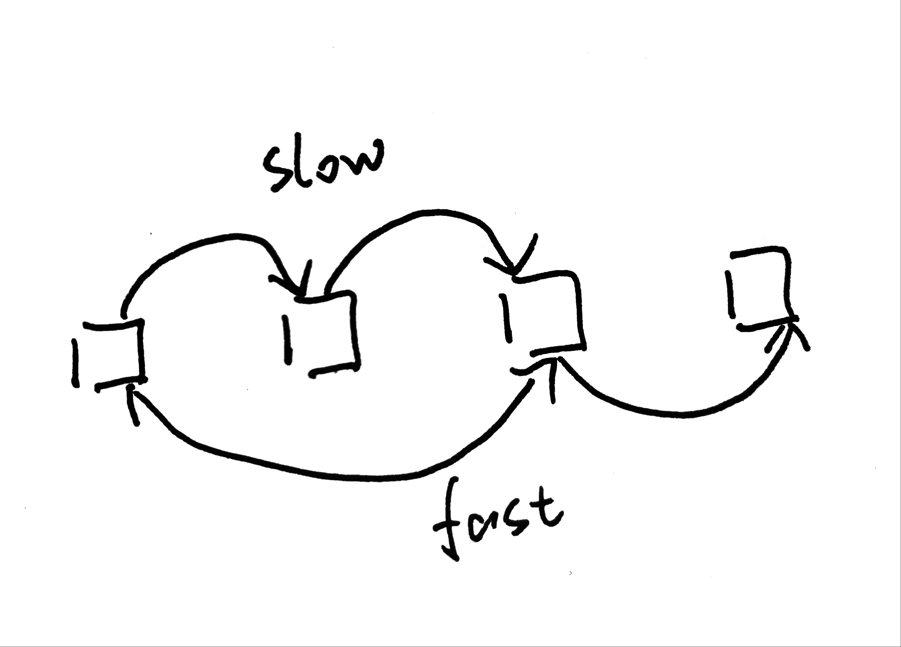

# 2020 M6W2 ARTS

# 1. Algorithm: leetCode.234 回文链表

## 1.1 题目描述

判断一个链表是否为回文链表

比如:

`1->2` 为false
`1->2->2->1` 为true

这道题考察的知识点是链表。

## 1.2 解题思路

使用快慢指针，慢指针每次前进一格，快指针每次前进两格。

通过这种方式来找到链表的中点，之后反转中点之后的链表，与中点前的链表做对比。

在细节上我们要考虑链表是奇数还是偶数的情况，偶数的链表快指针会提前终止，避免出现空的情况





```python
# @lc code=start
# Definition for singly-linked list.
# class ListNode:
#     def __init__(self, x):
#         self.val = x
#         self.next = None

class Solution:
    def isPalindrome(self, head: ListNode) -> bool:

        if not head:
            return True

        # 定义快指针慢指针
        fast = slow = head

        # 快指针移动两格，慢指针移动一格
        while fast:
            slow = slow.next
            fast = fast.next.next if fast.next else fast.next

        p, rev = slow, None
        # 反转中点之后的链表
        while p:
            rev, rev.next, p = p, rev, p.next

        # 从头开始将Head 与反转后的列表做对比
        while rev:
            if rev.val != head.val:
                return False
            rev = rev.next
            head = head.next
        return True
```

# 2. Review: MartinFlow关于CQRS的介绍

https://martinfowler.com/bliki/CQRS.html


# 3. Tip:  Guava的CacheLoader

CacheLoding是guava对本地缓存功能的良好抽象。

对于开销非常昂贵的操作，可以使用缓存

可以使用两种方式来创建

# 4. Share: 分享一篇有观点和思考的技术文章

# 5. 第一周总结

尝试ARTS打开的第一周，说实话有点忙乱。四个目标都没有很好的完成，要从繁忙的工作中、学习中再挤出时间去输出的确不是一件容易的事。

继续努力。