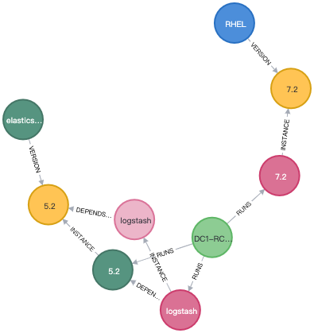

# 2020 M7W3 ARTS

# 1. Algorithm

## 1.1 面试题 16.07. 最大数值

> 编写一个方法，找出两个数字a和b中最大的那一个。不得使用if-else或其他比较运算符。
>
> 示例：
>
> ```
> 输入： a = 1, b = 2
> 输出： 2
> ```
>
> 来源：力扣（LeetCode）
> 链接：https://leetcode-cn.com/problems/maximum-lcci
> 著作权归领扣网络所有。商业转载请联系官方授权，非商业转载请注明出处。

这题看上去很奇怪，不能用比较符号怎么比较大小？但是仔细想想运算符的本质是啥？我还真答不上来。看了别人的解法我才明白用数学的方法可以来解这题。

首先，我们如果要求两数的之间的大值，可以使用以下公式$max(X,Y)=(X+Y)/2 + |X-Y|/2$，其实可以理解为将$X$、$Y$中将小的那部分补足。

```python
class Solution:
    def maximum(self, a: int, b: int) -> int:
        return (abs(a - b) + a + b) // 2
```


# 2. Review: [Agile Initiative Planning with Roadmaps](https://www.infoq.com/articles/agile-initiative-planning/)

1. 绝大多数公司/组织/机构依然是为了完成“项目”而不是为了“构建”产品；
2. 如果把项目在既定时间与预算内完成设计目标作为成功标志的话，大约只有20.5%项目可以算作成功；

# 3. Tip

## 3.1 RedisTemplate操作Sorted Set

```java
Set<ZSetOperations.TypedTuple<String>> typedTuples = redisTemplate.opsForZSet()
                   .rangeByScoreWithScores(keys, -1, excepted_score);
Iterator<ZSetOperations.TypedTuple<String>> iterator = typedTuples.iterator();
while (iterator.hasNext()) {
    // score --> value 的元组
    ZSetOperations.TypedTuple<String> next = iterator.next();
    long score = next.getScore().longValue();
    String body = next.getValue();
}

```


# 4. Share: 也说说知识管理

知识管理这种事好像不是什么知名的成功人士讲起来总不让人信服，不过对于我们普通人来说，找到一个好的知识管理工具能让我们学习事半功倍。

我这里讲的“工具”不是具体的某一款软件，而是一种思维方式。

先讲讲我遇到的问题吧。以前就不是很会做笔记，后来遇到了OneNote之后就开始使用那种编写一本书的组织来编写我的笔记，虽然看过网上很多对比OneNote与EverNote不同的知识组织结构，但我认为他们之间实在是大同小异，本质上还是树形结构+标签分类的形式。

在纸质时代，树形结构那种分类其实是受限于工具本身的，虽然在当时的阶段帮助我们完成了许多工作，但越深入越发觉得不符合人类的知识结构。在我的想法中，符合人类思维结构的应该是类似于图结构：所有的概念都是图中的点，概念与概念之间相互关联起来。



了解到**卡片盒笔记法**很偶然，但是看过几篇实践类文章之后我认为这就是我所找寻的知识管理思维。