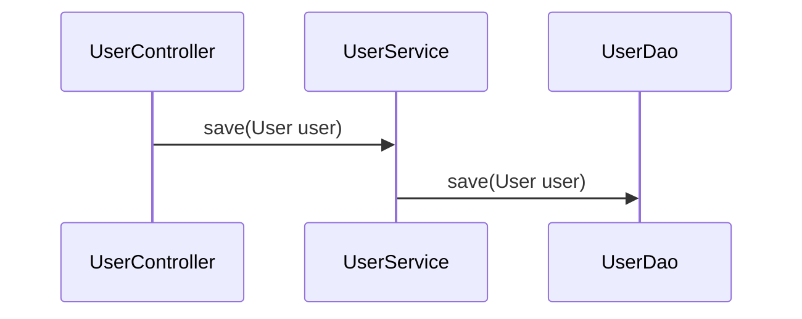

## 定义

Pass-through methods 可以描述为：虽然分了很多层，但是每个层次并没有增加新功能，只是用来传递参数。

> A pass-through method is one that does nothing except pass its arguments to another method, usually with the same API as the pass-through method.

是一种软件设计中的反模式，分层架构中很容易出现这种问题。

## 例子

比如我们定义了三层：

- **controller**层
- **service**层
- **dao**层

一个保存用户的逻辑可能是在每一层中有一个`save(User user)`方法并依次调用。

虽然看起来按职责分了多层，但每一层方法调用没有新增功能，只是用作传递。

之所为称其为一种反模式，本质上是因为这种方式是某种意义上的重复。

## 解决方案

- 将底层逻辑暴露给上层直接调用
- 合并方法