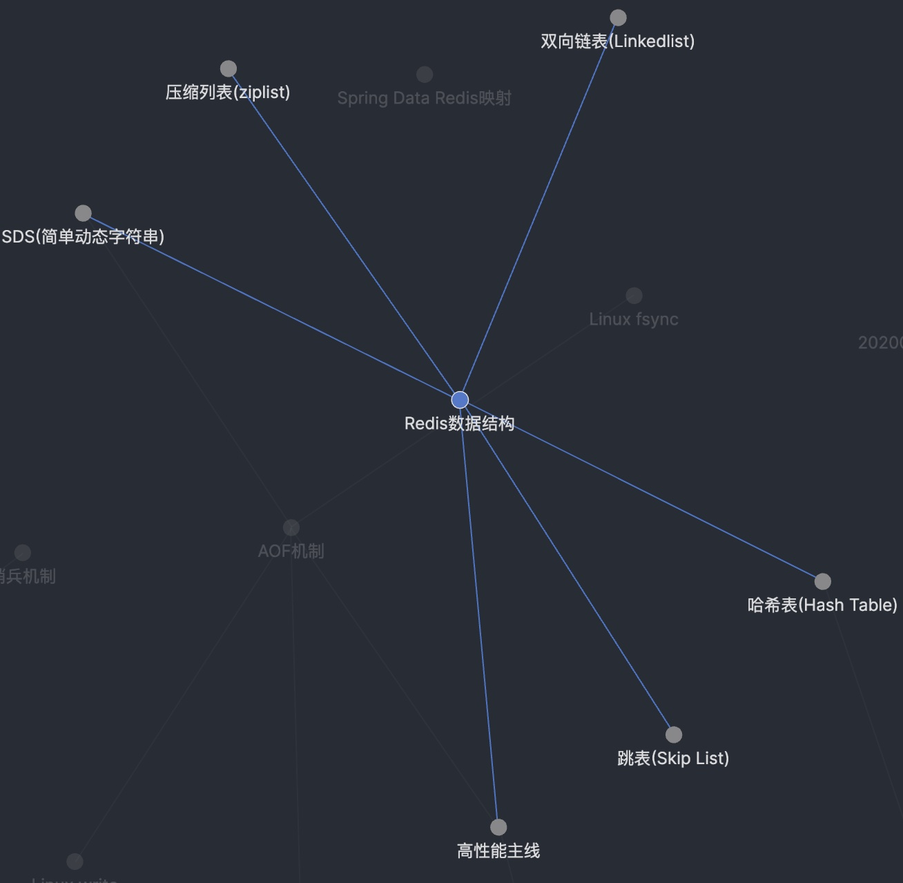

# 记录、连接、新知

## 记录是基石

两个月前我了解到卡片盒笔记法这种知识管理方法并付诸实践，两个月后对于卡片盒笔记法我有了更深的认识。

下图是我从之前使用的软件Obsidian中截取的，**Redis数据结构**所关联的知识点是**压缩列表**、**双向链表**、**简单动态字符串**、**哈希表**、**跳表**、以及**高性能**相关。

也就是说，应用卡片盒笔记发把我学到的知识打散并建立连接关系之后，我找到知识之间的关联，而这与之前的积累又无法区分开。知识之间的联系随着积累将越发清晰。

## 不妨记录细节

我也看过一些知识管理方法的分享，很多人都会强调要简单，但我认为没必要追求一切都简略，有些细节是你必须要记录的。

而且笔记系统是一个工具带给我们的外挂，人脑天生不善于记住细节，或者说我们大脑中记录的细节有很多偏差，

